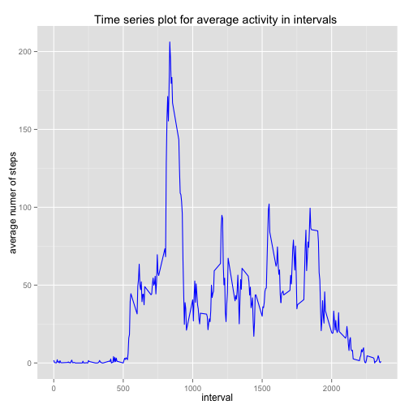
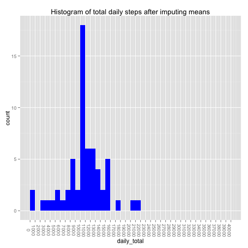

Assignment 1 : Reproducible Research
================================================================
  


```r

## Ketaki Kulkarni - July 14,2014 Project 1 - Reproducible Research
## Reproducible Research: Peer Assessment

# Adding required libraries
library(httr)
library(ggplot2)
library(plyr)
library(xlsx)
```

```
## Loading required package: rJava
## Loading required package: xlsxjars
```

```r

######### Part 1 of the assignment - Loading and processing the data###########

# get the file url
dataurl = "https://d396qusza40orc.cloudfront.net/repdata%2Fdata%2Factivity.zip"
# create a temporary directory
td = tempdir()
# create the placeholder file
tf = tempfile(tmpdir = td, fileext = ".zip")
# download into the placeholder file
download.file(dataurl, tf, method = "curl")
# get the name of the first file in the zip archive
fname = unzip(tf, list = TRUE)$Name
# unzip the file to the temporary directory
unzip(tf, files = fname, exdir = td, overwrite = TRUE)
# fpath is the full path to the extracted file
fpath = file.path(td, fname)
# using read.csv() function to read all the files
activity.data <- read.csv(file = fpath, header = TRUE, sep = ",")
```

Here is the summary of downloaded data available for further analysis :

```r
str(activity.data)
```

```
## 'data.frame':	17568 obs. of  3 variables:
##  $ steps   : int  NA NA NA NA NA NA NA NA NA NA ...
##  $ date    : Factor w/ 61 levels "2012-10-01","2012-10-02",..: 1 1 1 1 1 1 1 1 1 1 ...
##  $ interval: int  0 5 10 15 20 25 30 35 40 45 ...
```

```r
################### Part 2 - Mean total steps taken per day#######

total.steps <- ddply(activity.data, .(date), summarize, daily_total = sum(steps, 
    na.rm = T))

mean.steps <- mean(total.steps$daily_total, na.rm = T)
median.steps <- median(total.steps$daily_total, na.rm = T)
```

Here is the summary of mean and median total daily steps:


```r
mean.steps
```

[1] 9354

```r
median.steps
```

[1] 10395

Here is the histogram of total daily steps :

```r


p <- ggplot(total.steps, aes(x = daily_total)) + ggtitle("Histogram of the Total number of Steps taken each day") + 
    geom_histogram(binwidth = 1000, , fill = "blue") + theme(axis.text.x = element_text(angle = 270)) + 
    scale_x_continuous(breaks = seq(0, 40000, 1000), limits = c(0, 40000))
p
```

 


```r

###### Part 3 - Average Daily Activity Pattern##############
interval.steps <- ddply(activity.data, .(interval), summarize, interval_mean = mean(steps, 
    na.rm = T))

max.steps <- max(interval.steps$interval_mean)
max.interval <- subset(interval.steps, interval_mean == max.steps)
```


The max steps for the average per interval occurs in the following 5 minute interval:

```r

max.interval$interval
```

```
## [1] 835
```

Here is the time series plot by average number of steps per interval averaged across all days:

```r
p <- ggplot(interval.steps, aes(x = interval, y = interval_mean, fill = "blue")) + 
    geom_line(color = "blue") + scale_x_continuous(breaks = seq(0, 2355, 500), 
    limits = c(0, 2355))
p
```

 

```r

############### Part 4 Finding and filling missing values########

missing.values <- sum(is.na(activity.data))
```

Here is the total number of missing values 

```r
missing.values
```

```
## [1] 2304
```

Strategy to fill missing values 

1. Write a function to replace NA values with the mean
2. For the given dataset, use ddply to apply the impute mean function to replace NA values with the interval mean 


```r

impute.mean <- function(x) replace(x, is.na(x), mean(x, na.rm = TRUE))
filled.data <- ddply(activity.data, .(interval), transform, steps = impute.mean(steps))
# filled.data[order(filled.data[,2])] filled.data <- sort(filled.data$date)
names(filled.data)
```

```
## [1] "steps"    "date"     "interval"
```

```r
daily.steps.new <- ddply(filled.data, .(date), summarize, daily_total = sum(steps, 
    na.rm = T))
mean.steps.new <- mean(daily.steps.new$daily_total, na.rm = T)
median.steps.new <- median(daily.steps.new$daily_total, na.rm = T)
```

New  mean and median after filling the missing values :


```r
mean.steps.new
```

```
## [1] 10766
```

```r
median.steps.new
```

```
## [1] 10766
```

Here is the summary of mean daily steps after imputing missing data by means of a histogram :

```r
p <- ggplot(daily.steps.new, aes(x = daily_total)) + geom_histogram(binwidth = 1000, 
    fill = "blue") + theme(axis.text.x = element_text(angle = 270)) + scale_x_continuous(breaks = seq(0, 
    40000, 1000), limits = c(0, 40000))
p
```

 

The mean and median of total daily steps after filling in the missing values is higher than before, as would be expected.

This difference is as follows:


```r

Mean.Difference <- mean.steps.new - mean.steps
Mean.Difference
```

```
## [1] 1412
```

```r
Median.Differnece <- median.steps.new - median.steps
Median.Differnece
```

```
## [1] 371.2
```

```r

## Part 5 - Are there differences in activity patterns between weekdays and
## weekends? ###############

## Adding identifier columns for weekend and weekday

new.activity.data <- transform(filled.data, weekend = as.POSIXlt(date, format = "%Y/%m/%d")$wday %in% 
    c(0, 6))

new.activity.data(tail, 10)
```

```
## Error: could not find function "new.activity.data"
```

```r

```


